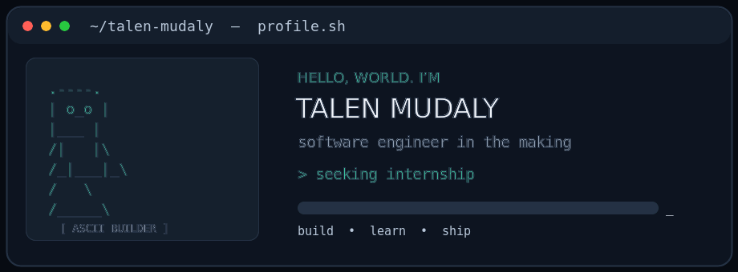

# Talen Mudaly

### Software engineering | Computing, The University of Manchester

**Seeking a software engineering internship** — ready to learn, contribute, and build useful things with a great team.

## About

My background combines computing-related studies at The University of Manchester with experience in software engineering and developer coaching. I’m looking for an internship where I can contribute to real projects, learn from experienced engineers, and keep growing as a developer.

## Experience

| Role | Organization |
| --- | --- |
| Software Engineer | Imago |
| MLH Coach | Major League Hacking |

## Education

**The University of Manchester**  
Computing-related degree

## Get in touch

📧 [talenmudaly@gmail.com](mailto:talenmudaly@gmail.com)

<!-- Add links and short, outcome-focused descriptions for your best projects here. -->
